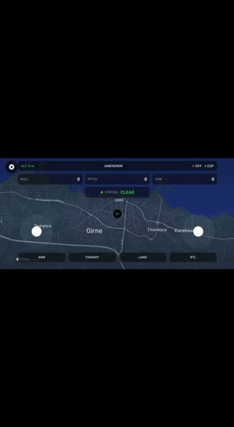
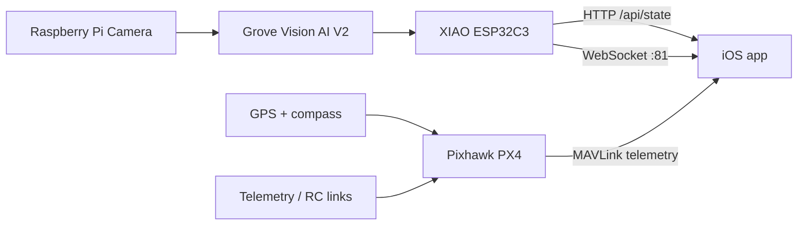
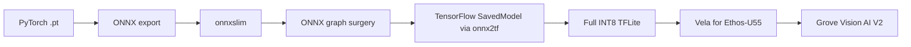

# Drone Fire Detection on Grove Vision AI V2

This repository documents the AI and edge-inference part of my bachelor's capstone project: a low-cost drone system for real-time fire and smoke detection.

The full capstone system combined a quadcopter platform, Pixhawk/PX4 flight control, GPS + telemetry, an iOS ground-station app, and an onboard edge-AI detector built around `Grove Vision AI V2` and `XIAO ESP32C3`.

The most important thing about this repo is that it captures the only deployment pipeline in our project that consistently produced a model which could be loaded onto the `Grove Vision AI Module V2` and actually run on-device without crashing with `Invoke Failed`.

## Built Drone

Photo of the final quadcopter prototype used in the capstone project.


## App Demo

Short demo of the iOS application showing detection state transitions such as `CLEAR -> FIRE -> CLEAR -> SMOKE -> CLEAR`.



## What This Repository Covers

- training a fire/smoke detection model,
- evaluating and shrinking it for embedded deployment,
- converting it through a working `PyTorch -> ONNX -> TensorFlow -> TFLite INT8 -> Vela` pipeline,
- integrating Grove detections with `XIAO ESP32C3`,
- filtering unstable detections on the microcontroller,
- sending the final fused state to a client app over Wi-Fi.

The broader capstone project also included:

- quadcopter hardware design,
- Pixhawk + PX4 configuration in `QGroundControl`,
- telemetry and mission setup,
- an iOS monitoring/control application.

Not all of those components are stored in this repo, but they are summarized here for context.

## Full Project Overview

At a system level, the project looks like this:



In the final capstone system:

- the drone platform was based on an `F450` frame,
- flight control used `Pixhawk PX4 2.4.8`,
- the AI module was `Grove Vision AI V2`,
- the companion MCU was `XIAO ESP32C3`,
- the mobile client was an iOS app,
- the total system cost was roughly `~EUR700`, which is far below thermal-camera-based solutions.

## Why This Repo May Be Useful

If you are trying to deploy a custom model to `Grove Vision AI V2`, this repo may save you a lot of time.

During the project, several seemingly correct export paths produced either:

- `Invoke Failed`,
- incompatible tensor outputs,
- or a model that technically ran but produced unusable false positives.

The pipeline preserved here is the one that finally worked reliably enough for real device tests.

## Repository Contents

The repository is intentionally small and focused:

- `fire_detection_yolo8n_training.ipynb`  
  Colab notebook for training and evaluating the fire/smoke detector.

- `deployment_pipeline.ipynb`  
  Colab notebook for export, graph cleanup, INT8 quantization, and `Ethos-U55` / `Vela` compilation.

- `fire_detection_esp.ino`  
  Firmware for `XIAO ESP32C3` that receives detections from the Grove module, applies post-processing, and exposes the fused state over Wi-Fi.

## My Contribution

My work in this capstone was the full AI path from model development to usable edge output:

- dataset-based fire/smoke model training,
- model evaluation and embedded-friendly resizing,
- debugging failed deployment attempts,
- building a working conversion pipeline for `Grove Vision AI V2`,
- validating runtime behavior on the module,
- implementing ESP32-side filtering and state logic,
- forwarding the final detection state to the app.

## AI Model

### Detection Task

The detector targets two classes:

- `Fire`
- `Smoke`

The dataset was sourced from `Roboflow` and split into:

- `13,712` training images,
- `1,959` validation images,
- `981` test images.

Although earlier experiments also explored larger training resolutions and extra classes, the checked-in notebook in this repo trains the exportable model at:

- `YOLOv8n`,
- `imgsz=192`,
- `epochs=100`,
- `batch=16`,
- `patience=20`.

That choice reflects the reality of embedded deployment: a model that is slightly smaller but actually runs on the target hardware is more valuable than a stronger model that never makes it onto the device.

### Test Metrics From the Checked-In Notebook

The current notebook run reports the following test results for the `192x192` model:

- Precision: `0.744`
- Recall: `0.662`
- mAP@50: `0.702`
- mAP@50-95: `0.408`

Per-class test performance:

- Fire: `mAP@50 = 0.589`, `mAP@50-95 = 0.282`
- Smoke: `mAP@50 = 0.815`, `mAP@50-95 = 0.535`


## Grove Vision AI V2 Deployment Pipeline

This is the core of the repository.

The final working path was:



### Exact Practical Notes From the Working Pipeline

The checked-in `deployment_pipeline.ipynb` uses:

- fixed input size `192x192`,
- `opset=12`,
- `dynamic=False`,
- `simplify=True` during ONNX export,
- `onnxslim` for graph cleanup,
- `onnx-graphsurgeon` to patch the graph,
- `onnx2tf` for ONNX -> TensorFlow conversion,
- strict full `INT8` quantization,
- `Vela` with `--accelerator-config ethos-u55-64`.

It also uses a representative dataset for quantization made of:

- `350` fire samples,
- `150` no-fire samples.

That calibration step turned out to be important. A plain conversion without a proper representative dataset was not enough.

### Why Earlier Approaches Failed

Our deployment path went through multiple phases before reaching a stable result:

1. Direct `YOLOv8` / `YOLOv11` style exports to `TFLite INT8` still failed on-device with `Invoke Failed`.
2. `Edge Impulse` + `FOMO` produced a tiny model, but it still failed on the module.
3. The official `SSCMA` toolchain could generate a valid file, but successful compilation alone did not guarantee runtime compatibility.
4. A custom firmware path made the model execute, but the predictions were unstable and produced constant false positives.
5. The final pipeline in this repo was the first one that gave a reproducible, working deployment path for the module.

### What Actually Matters for Grove Vision AI V2

From this project, these were the most important lessons:

- A model being small is **not** enough.
- A model exporting to plain `.tflite` is **not** enough.
- Mixed precision can break deployment; the working path enforced full `INT8`.
- The module/runtime is sensitive to output tensor structure and post-processing expectations.
- `Vela` compilation for `Ethos-U55` is essential.
- Graph simplification and output alignment matter.
- Calibration quality matters.

In other words: **successful export does not mean successful inference on the hardware**.

## ESP32 Integration and Post-Processing

The `fire_detection_esp.ino` sketch is the runtime bridge between the Grove module and the mobile client.

It uses:

- `Seeed_Arduino_SSCMA`
- `WiFi.h`
- `WebServer.h`
- `WebSocketsServer.h`
- `ArduinoJson.h`

### Grove -> ESP32 Flow

Observed runtime behavior:

- `ret = 0` means a valid frame is ready,
- `ret = 3` means the module is busy.

One of the critical logic fixes in this project was making sure the temporal window is updated **for every frame**, including `ret = 3`. Without that, the state machine could get stuck and fail to return to `CLEAR`.

### False-Positive Filtering

Raw detections from the module are not used directly.

The ESP32 applies three layers of filtering:

1. Geometric validation  
   Per-class thresholds for width, height, area, and aspect ratio.

2. Temporal aggregation  
   A sliding window of `15` frames with hysteresis.

3. Stability gating  
   Smoke detections are additionally filtered by center-jump stability.

The main thresholds in the checked-in firmware are:

- Fire geometry: `minW=20`, `minH=20`, `minArea=700`, aspect `0.35-3.5`
- Smoke geometry: `minW=28`, `minH=20`, `minArea=900`, aspect `0.45-4.8`
- Smoke max area: `30000`
- Smoke center jump limit: `48 px`

Temporal logic:

- window size: `15`
- fire on: `>= 4` hits
- smoke on: `>= 5` hits
- fire off: `< 2` hits
- smoke off: `< 2` hits

Final states:

- `CLEAR`
- `FIRE`
- `SMOKE`
- `FIRE+SMOKE`

### Networking

The firmware exposes two interfaces:

- HTTP server on port `80`
- WebSocket server on port `81`

Available endpoints:

- `GET /` -> simple built-in dashboard page
- `GET /api/state` -> current fused detection state as JSON
- `ws://<esp-ip>:81` -> live `heartbeat` and `state_change` events

Example WebSocket transition event:

```json
{
  "event": "state_change",
  "from": "CLEAR",
  "to": "FIRE",
  "fire_hits": 4,
  "smoke_hits": 0
}
```

### Wi-Fi Notes

For our setup:

- the `XIAO ESP32C3` worked over `2.4 GHz` Wi-Fi only,
- an iPhone hotspot was used successfully during tests,
- the ESP32 firmware includes a basic reconnect watchdog,
- the device can be accessed from a browser at `http://<esp-ip>/`.

Before uploading the sketch, update:

- `WIFI_SSID`
- `WIFI_PASSWORD`

inside `fire_detection_esp.ino`.